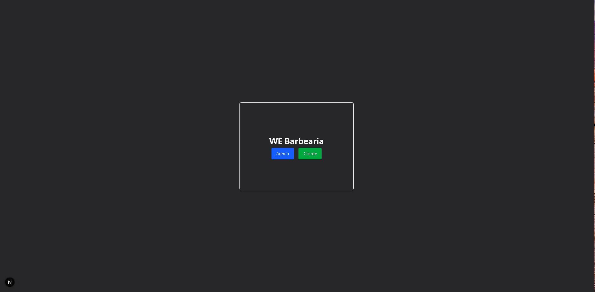
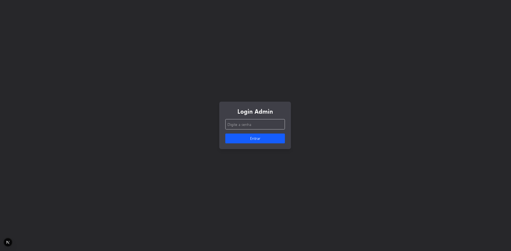
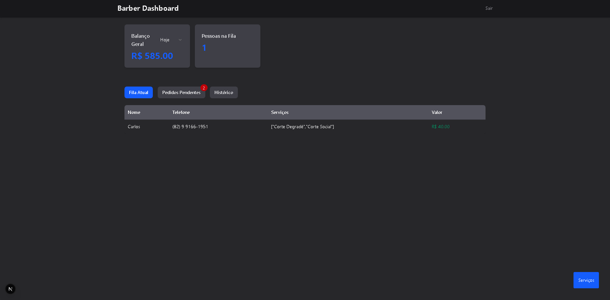
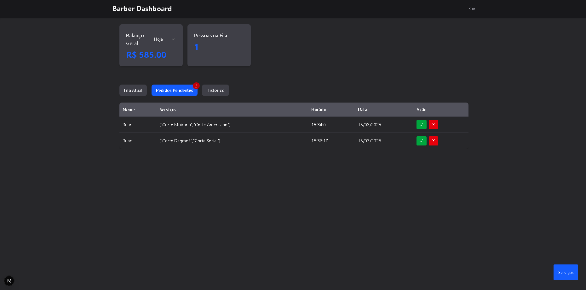
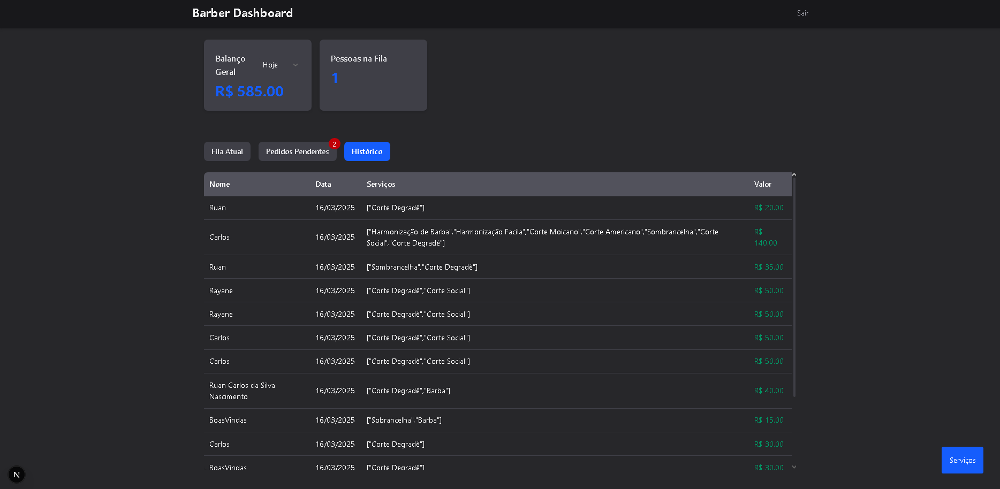
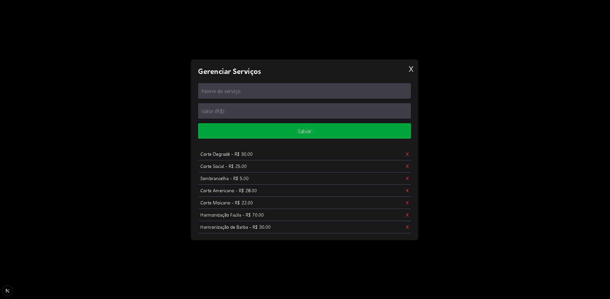
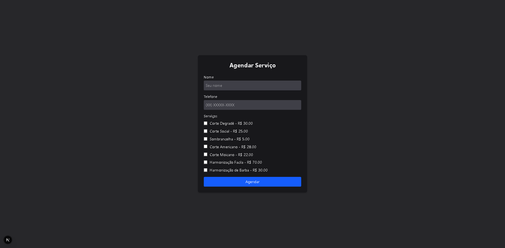
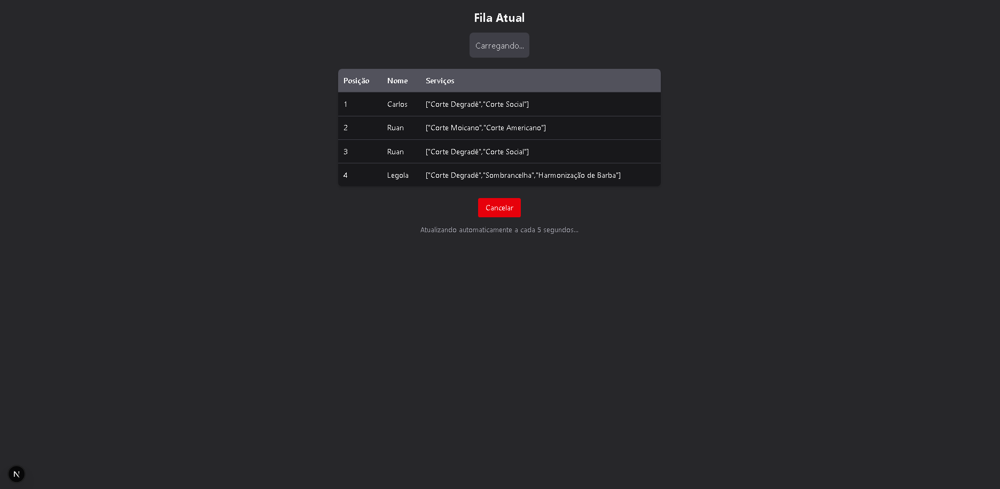

# ✂️ Barber Queue

**Barber Queue** is a complete queue management system designed for barbershops. Built with **Next.js** and **TailwindCSS**, it provides an intuitive interface for both **clients** and **barbers**, optimizing workflow and enhancing customer experience.

## 🚀 Features

### 🏠 Main Screen

- Clients and admins access the system from a single entry point.
- **Admin authentication** required for administrative access.
- Clients can enter their details and select desired services.

### 👤 Client Flow

1. Enter **name** and **phone number**.
2. Select **services** from the available options.
3. Submit the request to join the queue.
4. Wait for **admin approval** to enter the queue.
5. Once approved, they are placed at the **end of the queue**.
6. The client can **cancel** at any time.
7. The queue **updates dynamically** as clients are processed.

### ✂️ Admin Flow

1. Receives a **pending request notification**.
2. Reviews the **client's name and requested services**.
3. Accepts or declines the request.
4. If accepted, the client is **added to the queue**.
5. After finishing a service, the admin marks it as **completed**.
6. Completed clients move to the **service history section**.
7. The queue updates **in real time** as clients are processed.

### 📊 Dashboard Overview

- **Revenue statistics**:
  - Today’s earnings 💰
  - Earnings over the past **7 days, 30 days, 6 months, and 1 year**.
- **Active queue count**: Shows the number of clients currently in line.
- **Pending requests indicator**:
  - Red notification 🔴 with the number of **pending approvals**.

## 🛠️ Tech Stack

- **Frontend & Backend**: Next.js (Full-stack)
- **Styling**: TailwindCSS
- **Database**: SQLite with Prisma ORM
- **State Management**: Context API (No Redux)

## 📸 Screenshots

### 🏠 Main Screen


### ✂️ Admin Pass


### ✂️ Admin Queue


### ✂️ Admin Pending


### ✂️ Admin History


### ✂️ Admin Add Services



### 👤 Client Requisition


### 👤 Client Queue



*Add images here to showcase the application*

## 🏗️ Installation & Setup

```bash
# Clone the repository
git clone https://github.com/yourusername/barber-queue.git
cd barber-queue

# Install dependencies
yarn install # or npm install

# Run the development server
yarn dev # or npm run dev
```

## 🎯 Future Improvements

-

## 📜 License

This project is **open-source** and available under the [MIT License](LICENSE).

---

Enjoy **Barber Queue**! 🚀💈

© 2025 Ruan Carlos. All rights reserved. 🚀💈

